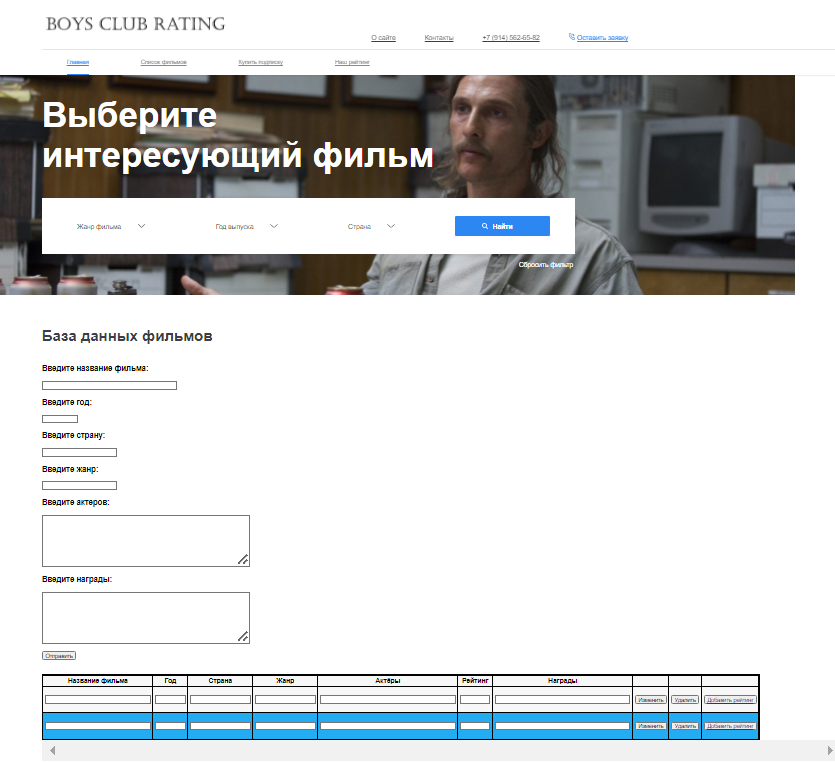
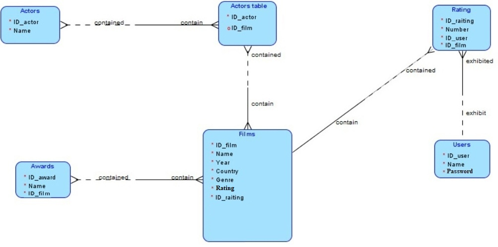
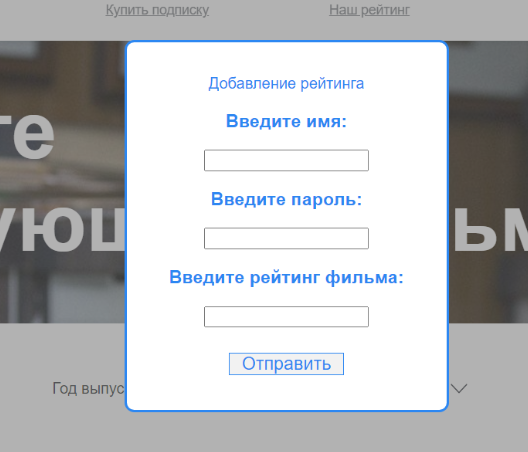
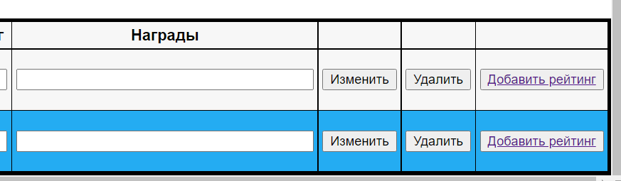

# BoysClubRating

## Навигация: 
### [1. Общее описание проекта](#description)
### [2. Рефакторинг и сопровождение Frontend(Роман Жлуткин)](#frontend)
### [3. Рефакторинг и сопровождение Backend(Максим Шешин)](#backend)

## 1. Общее описание проекта
 Данный сайт был написан в качестве финального проекта в рамках 
 зачёта по предмету ***"Проектирование и разработка баз данных"***. 
 Сайт является обёрткой для базы данных с фильмами, 
 соответствующая информация о фильмах представлена в таблице, которая располагается внизу HTML страницы.

#### Структура и сущности базы данных представлены на скриншоте ниже:

#### На данный момент сайт способен поддерживать следующий функционал:
* Выставление рейтинга отдельным пользователем. Для этого необходимо нажать на кнопку "Добавить рейтинг", 
после чего откроется специальная форма, которая авторизирует пользователя и выдаст ему соответствующие права
на выставление рейтинга фильма по 10-ти бальной шкале. Рейтинг фильма, представленный в таблице - это целое число и формируется оно как среднее арифмитическое от всех оценок, 
которые выставили пользователи с округлением в большую сторону.

* Возможность изменять данные о фильме в таблице. Для этого необходимо Нажать кнопку "Изменить" в строке фильма, 
информацию о котором хочет изменить пользователь. Важно отметить, что данная кнопка не изменяет рейтинг фильма, который пользователь
выставил раннее. Для того, чтобы изменить рейтинг, необходимо вновь нажать кнопку "Добавить рейтинг" и авторизироваться.
* Удаление фильма из таблицы и соответствующей информаии о нём. Для этого необходимо нажать кнопку "Удалить", 
в строке фильма, который хочет удалить пользователь.
* Добавление нового фильма и соответствующей информации о нём. Осуществляется через заполнение пользователем специальных форм
на самой странице и последующее нажание кнопки "Отправить".

Также, важно отметить, что пользователей в базу данных сайта может занести только администратор, форма для регистрации не подразумевалась изначально.

#### ***Frontend*** данного сайта написан с использованием следующих технологий:
* HTML
* CSS
* JavaScript
* JQuerry

#### ***Backend*** данного сайта написан с использованием следующих технологий:
* PHP
* Ajax
* phpMyAdmin для администрирования СУБД
* MySQL

## 2. Рефакторинг и сопровождение Frontend(Роман Жлуткин)
Необходимо выполнить следующие изменения:
#### 1. Переписать весь код, отвечающий за ***Frontend*** на фреймворк AngularJS(язык TypeScript) с улучшением его качества и читаемости, насколько это возможно.
Этот шаг позволит сделать перемещение по сайту более быстрым, чем если бы добавлялось несколько HTML-страниц 
за счёт использования одностраничного приложения(SPA - Single Page Application). Данная технология использует единственный 
HTML-документ(который загружается всего лишь один раз - при загрузке самого сайта) как оболочку для всех
веб-страниц и организует взаимодействие с пользователем через динамически подгружаемые HTML, CSS, JavaScript, посредством AJAX-запросов, что существенно ускоряет 
навигацию по сайту и убирает время ожидания загрузки при перемещении по сайту.
#### 2. Добавление страницы для регистрации пользователя.
На данный момент пользователя в базу данных заносит администратор сайта, что, очевидно, урезает сайт в функционале.
#### 3. Добавление страницы с личным кабинетом пользователя.
Предполагается, что на данной странице пользователь сможет изменить своё имя и пароль, а также посмотреть рейтинги, которые он поставил к фильмам.
#### 4. Изменение окна авторизации пользователя, в частности, его дизайна.
#### 5. Изменение и редизайн таблицы с данными на главной странице, а также форм для добавления информации.
Необходимо сделать интерфейс главной страницы более минималистичным, с меньшей информационной нагрузкой, без потери функционала и при этом более интуитивным.
#### 6. Убрать все неиспользуемые кнопки и добавить используемые для соответствующих страниц сайта(Главная страница с таблицей, личный кабинет, страница регистрации)
#### 7. Сделать сайт адаптивным под экраны любых размеров различных устройств.

### Код, отвечающий за мою часть проекта(frontend) представлен в файлах проекта:
* #### index.html
* #### style.css
* #### В папке js:
  * #### jquery-3.5.1.min.js
  * #### n3.js

## 3. Рефакторинг и сопровождение Backend(Максим Шешин)
